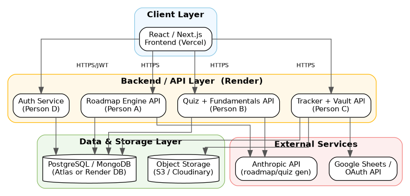
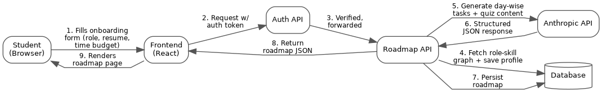
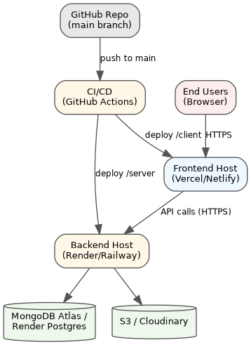

# ARCHITECTURE.md

System architecture, data flow, and deployment design for the Career Readiness & Skill Development Platform. Read this alongside `docs/CONTRACTS.md` (shared data/API contracts) and `PROJECT_TASKS.md` (per-member task detail).

---

## 1. Overview

The system follows a standard three-tier architecture — client, backend/API, and data/storage — with two external services (an LLM provider and Google APIs) called from the backend only, never directly from the frontend, so API keys and secrets stay server-side.

The backend is organized as four route modules, one per team member, all sitting behind a single shared authentication middleware.

---

## 2. System Architecture

*Client, API, data/storage, and external service layers, with each API module mapped to its owning team member.*

### 2.1 Layer Descriptions

**Client Layer**
React/Next.js frontend, deployed on Vercel or Netlify. Handles all UI rendering and makes authenticated HTTPS requests to the backend. Never talks to the database, object storage, or external APIs directly.

**Backend / API Layer**
Node.js + Express, deployed on Render or Railway. Split into four route modules:
- **Auth Service** (Person D) — signup/login, Google OAuth, profile, dashboard aggregation
- **Roadmap Engine API** (Person A) — roles, skill-gap analysis, roadmap generation and updates
- **Quiz + Fundamentals API** (Person B) — quiz generation/scoring, CS fundamentals tracking
- **Tracker + Vault API** (Person C) — application tracking, Google Sheets sync, certificate/badge storage

All four modules sit behind the same JWT auth middleware (see `docs/CONTRACTS.md` section 6).

**Data & Storage Layer**
- MongoDB Atlas — structured data (users, roadmaps, applications, quiz attempts, etc.)
- Object storage (AWS S3 or Cloudinary, decided by Person C) — uploaded files (resumes, certificate uploads). Only file URLs are stored in the database, never the raw files.

**External Services**
- LLM provider (Anthropic or Groq, TBD — see `docs/CONTRACTS.md`) — resume parsing, day-wise task generation, quiz generation. Always called through the internal `llm.service.js` wrapper, never directly from a route/controller.
- Google APIs — OAuth login (Person D) and Sheets sync (Person C), sharing one Google Cloud project.

---

## 3. Data Flow — Example: Onboarding to Roadmap Generation

This traces what happens end-to-end when a student completes onboarding, since it's the clearest illustration of how the layers connect.

*Request flow from onboarding form submission to rendered roadmap.*

1. Student fills the onboarding form (target role, resume upload or manual skills, time budget)
2. Frontend sends the request to the backend with the user's auth token attached
3. Auth middleware verifies the token and forwards the request to the Roadmap API
4. Roadmap API fetches the role-skill graph and saves the user's skill profile to the database
5. Roadmap API calls the LLM service to generate day-wise task bundles based on the skill gap and time budget
6. LLM service returns structured task data (JSON)
7. Roadmap API persists the full generated roadmap to the database
8. Roadmap API returns the roadmap JSON to the frontend
9. Frontend renders the day-wise roadmap page for the student

The same general pattern (client → auth middleware → feature API → database and/or LLM → response) applies to every other feature — quiz generation, application sync, certificate upload — just swapping which module handles steps 3-7.

---

## 4. Deployment Architecture

*Deployment pipeline from GitHub push through CI/CD to live frontend, backend, database, and storage.*

Deployment is split across managed platforms so each piece can scale independently and stay within free-tier limits for a student project. GitHub Actions drives continuous deployment on every push to `main`.

### 4.1 Deployment Components

| Component | Platform |
|---|---|
| Frontend | Vercel or Netlify — auto-deploys `/client` on every push to `main` |
| Backend | Render or Railway — auto-deploys `/server` on every push to `main` |
| Database | MongoDB Atlas (shared dev + production databases — kept separate) |
| Object Storage | AWS S3 or Cloudinary free tier |
| CI/CD | GitHub Actions — runs tests on PRs into `dev`; deploy triggers only on merges to `main` |
| Secrets | Environment variables set per platform (LLM API key, Google OAuth credentials, DB connection string) — never committed to Git |

### 4.2 Environments

- **Local development** — everyone connects to the same shared MongoDB Atlas *dev* database (see `docs/CONTRACTS.md` section 9), using the fixed placeholder user `dev-user-1` before real auth is wired in.
- **`dev` branch** — integration branch where all feature branches merge first; can optionally auto-deploy to a staging environment for team testing.
- **`main` branch** — production. Only updated from `dev` after integration testing passes. Auto-deploys to the live, public-facing app.

---

## 5. Design Principles Behind This Architecture

- **Feature-vertical ownership** — each backend module (and its matching frontend pages) is owned end-to-end by one person, reducing blocking dependencies during parallel development. See `PROJECT_TASKS.md` section 0.7 for the full dependency map.
- **No direct cross-writes** — no module ever writes into another module's database collection directly; it always goes through that module's own API endpoint (e.g., the Quiz system calls the Roadmap Engine's `/skills/verify` endpoint rather than updating `SkillProfile` itself).
- **Provider-agnostic AI layer** — all LLM calls route through one internal service (`llm.service.js`) so the underlying provider can change without touching feature code.
- **Secrets stay server-side** — the frontend never holds API keys for the LLM provider, Google APIs, or object storage; all such calls are proxied through the backend.
- **Single source of truth for contracts** — `docs/CONTRACTS.md` defines every shared data shape, enum, and convention referenced throughout this document.

---